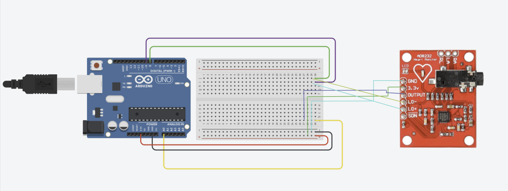

# ECG Recorder

This is a simple ECG recorder using the [AD8232](https://www.analog.com/media/en/technical-documentation/data-sheets/AD8232.pdf) chip and an Arduino Uno.

## Table of Contents

- [ECG Recorder](#ecg-recorder)
  - [Table of Contents](#table-of-contents)
  - [Demo](#demo)
  - [Circuit Diagram](#circuit-diagram)
  - [Hardware](#hardware)
  - [Connections](#connections)
  - [Usage](#usage)
  - [Details](#details)
  - [Authors](#authors)

## Demo

## Circuit Diagram

<kbd></kbd>

## Hardware

- Arduino Uno
- AD8232

## Connections

| Board label | Pin Function | Arduino UNO Connection |
|---|---|---|
| GND | Ground | GND |
| 3V3 | 3.3V | 3V3 |
| OUTPUT | Analog output of the sensor | A0 |
| LO- | Leads-Off Detect - | D8 |
| LO+ | Leads-Off Detect + | D9 |

### AD8232 Pins

- RA - Input 1
- LA - Input 2
- RL - Input 3

## Usage

- It detects cholesterol clogging on the heart.
- Possibility of heart attacks or past heart attacks.
- Enlargement of one side of the heart.
- Abnormal heart rhythms or dope-lope.

## Details

- Irregular heartbeat or absence of P-wave: Atrial Fibrillation
- Resting Heart Rate of more than 100: Tachyarrhythmia
- Tachyarrhythmia and delta wave: Wolf-Parkinson-White or WPW syndrome
- Sawtooth P wave: Atrial flutter
- Depression of ST-segment: it might indicate Ischemia
- Elevation of ST-segment: it might indicate myocardial Infarction

## Upcoming Features

- [ ] Add a buzzer to alert the user when the heart rate is abnormal.
- [ ] Add a display to show the heart rate.
- [ ] Add a bluetooth module to send the data to a smartphone.

## Authors

- [Mantresh Khurana](https://github.com/mantreshkhurana)
- [Manish Kumar](https://github.com/its-manishks)
- [Sivaram Vinod](https://github.com/sivaram-vinod)
